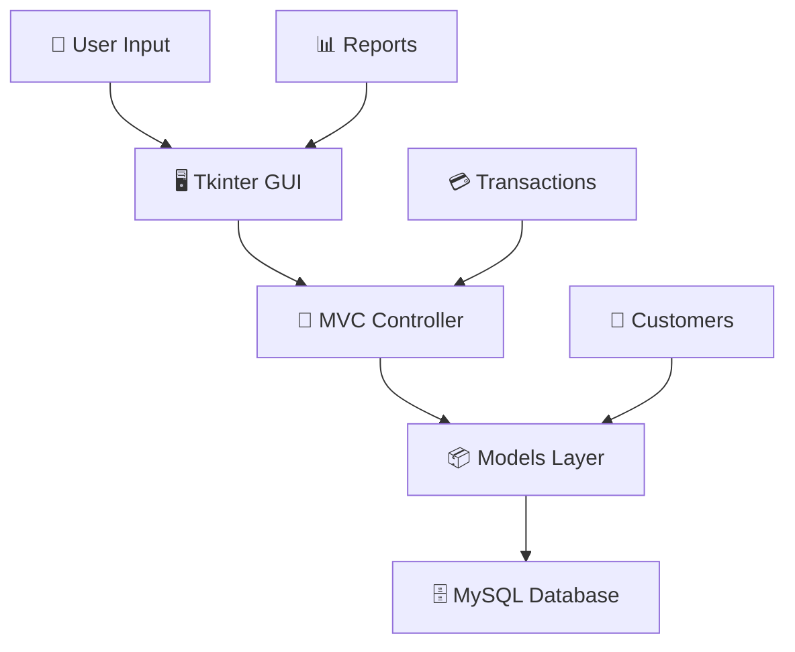
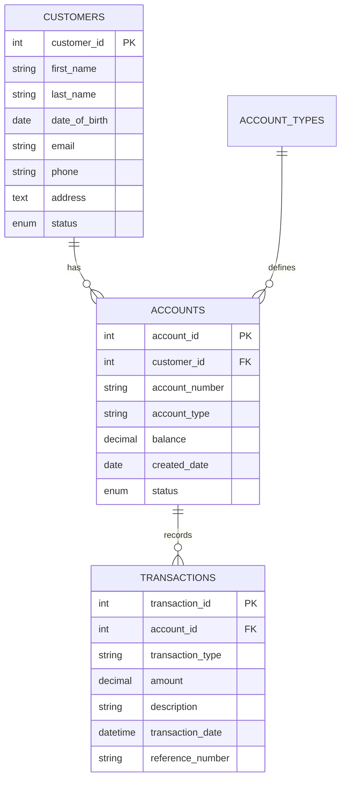

<div align="center">

# 🏦 Professional Bank Management System

*A modern, feature-rich banking solution that brings enterprise-level functionality to your desktop*

[](https://python.org)
[](https://mysql.com)
[](LICENSE)
[](https://docs.python.org/3/library/tkinter.html)

**🚀 Transform your banking operations with this comprehensive, production-ready system!**

</div>

---

## 💫 What Makes This Special?

This isn't just another banking system – it's a **complete financial ecosystem** designed with modern practices and enterprise-grade features. Built from the ground up with security, scalability, and user experience in mind.

## 🌟 Core Features

<table>
<tr>
<td width="50%">

### 👥 Customer Management
- 📝 **Smart Registration**: Add customers with comprehensive profiles
- 🔍 **Advanced Search**: Find customers instantly with multiple filters
- ✏️ **Live Updates**: Real-time profile editing and status management
- 📊 **Activity Tracking**: Complete customer interaction history

</td>
<td width="50%">

### 💳 Account Operations
- 🆕 **Multi-Account Types**: Savings, Current, FD, RD support
- 💰 **Real-time Balances**: Live balance tracking and updates
- 🔐 **Secure Management**: Account status and security controls
- 📈 **Interest Calculations**: Automated interest computation

</td>
</tr>
<tr>
<td width="50%">

### 💸 Transaction Engine
- ⚡ **Lightning Fast**: Instant deposits and withdrawals
- 🔄 **Smart Transfers**: Inter-account transfers with validation
- 📋 **Complete History**: Full transaction audit trails
- 🎯 **Unique References**: Auto-generated transaction IDs

</td>
<td width="50%">

### 📊 Reports & Analytics
- 📈 **Rich Dashboards**: Comprehensive financial reports
- 📥 **Export Ready**: CSV, PDF export capabilities
- 🎨 **Visual Charts**: Beautiful data visualization
- 🕒 **Time-based Analysis**: Historical trend analysis

</td>
</tr>
</table>

## ✨ Why Choose This System?

<div align="center">

| 🎯 **Feature** | 🏆 **Our Solution** | 🔧 **Traditional Systems** |
|----------------|---------------------|----------------------------|
| **User Interface** | 🎨 Modern, Intuitive GUI | 📊 Complex, Outdated Forms |
| **Security** | 🔐 ACID Compliant Transactions | ⚠️ Basic Validation |
| **Performance** | ⚡ Real-time Updates | 🐌 Batch Processing |
| **Scalability** | 📈 MVC Architecture | 🏗️ Monolithic Structure |
| **Maintenance** | 🛠️ Modular Design | 🔧 Tightly Coupled Code |

</div>

## 🛠️ Tech Stack & Architecture

<div align="center">



</div>

| Layer | Technology | Purpose |
|-------|------------|---------|
| **Frontend** | 🖼️ Tkinter | Modern GUI with responsive design |
| **Backend** | 🐍 Python 3.8+ | Business logic and data processing |
| **Database** | 🗄️ MySQL 8.0+ | Reliable data storage with ACID properties |
| **Architecture** | 🏗️ MVC Pattern | Clean separation of concerns |
| **Connectivity** | 🔌 mysql-connector-python | Robust database connections |

## � Quick Start Guide

<div align="center">


</div>

### 📦 Prerequisites Checklist
- ✅ Python 3.8+ installed
- ✅ MySQL Server 8.0+ running
- ✅ pip package manager available

### 🎯 Installation Steps

```bash
# 1️⃣ Clone the repository
git clone https://github.com/yourusername/Professional-Bank-Management-System.git
cd Professional-Bank-Management-System

# 2️⃣ Install dependencies
pip install mysql-connector-python

# 3️⃣ Configure database (update config.py)
# Edit the DB_CONFIG section with your MySQL credentials

# 4️⃣ Initialize database
python setup_database.py

# 5️⃣ Launch the application
python main.py
```

### ⚙️ Database Configuration

```python
# 📝 Edit config.py with your MySQL details
DB_CONFIG = {
    'host': 'localhost',           # 🏠 Your MySQL host
    'user': 'your_username',       # 👤 Your MySQL username  
    'password': 'your_password',   # 🔐 Your MySQL password
    'database': 'bank_management', # 🗄️ Database name
    'port': 3306,                  # 🔌 MySQL port
    'charset': 'utf8mb4',          # 📝 Character encoding
    'autocommit': True             # ⚡ Auto-commit transactions
}
```

## 📁 Project Architecture

<details>
<summary><b>🏗️ Click to explore the project structure</b></summary>

```
🏦 Professional-Bank-Management-System/
│
├── 🚀 main.py                    # Application entry point
├── ⚙️ config.py                  # Database & app configuration
├── 🗄️ setup_database.py          # Database initialization wizard
├── 📋 requirements.txt           # Python dependencies
│
├── 📊 models/                    # Data models & business logic
│   ├── 👤 customer.py           # Customer data operations
│   ├── 💳 account.py            # Account management logic
│   └── 💸 transaction.py        # Transaction processing engine
│
├── 🖼️ gui/                       # User interface components
│   ├── 🏠 main_window.py        # Main application window
│   ├── 👥 customer_window.py    # Customer management interface
│   ├── 💳 account_window.py     # Account operations interface
│   ├── 💸 transaction_window.py # Transaction processing GUI
│   └── 📈 reports_window.py     # Reports & analytics dashboard
│
├── 🗄️ database/                  # Database scripts & schema
│   ├── 📝 schema.sql            # Database structure definition
│   └── 🎯 sample_data.sql       # Demo data for testing
│
└── 🛠️ utils/                     # Utility functions & helpers
    ├── ✅ validators.py          # Input validation functions
    ├── 🔧 helpers.py            # Common helper functions
    └── ⚠️ exceptions.py         # Custom exception classes
```

</details>

## 🎯 Feature Deep Dive

<details>
<summary><b>👥 Customer Management System</b></summary>

### What You Can Do:
- 📝 **Smart Registration**: Comprehensive customer onboarding
- 🔍 **Lightning Search**: Find customers instantly with multiple filters
- ✏️ **Live Editing**: Update customer information in real-time
- 📊 **Status Tracking**: Monitor customer account status and activity
- 🎯 **Validation**: Built-in data validation for accuracy

</details>

<details>
<summary><b>💳 Account Management Hub</b></summary>

### Account Types Supported:
- 💰 **Savings Account**: Standard savings with interest calculation
- 🏢 **Current Account**: Business accounts with overdraft facilities
- 🔒 **Fixed Deposit**: Time-locked deposits with higher returns
- 🔄 **Recurring Deposit**: Regular savings with compound interest

### Features:
- ⚡ Real-time balance tracking
- 📈 Automated interest calculations
- 🔐 Secure account status management
- 📊 Account performance analytics

</details>

<details>
<summary><b>💸 Transaction Processing Engine</b></summary>

### Transaction Types:
- 📥 **Deposits**: Secure money deposits with instant confirmation
- 📤 **Withdrawals**: Safe money withdrawals with balance validation
- 🔄 **Transfers**: Inter-account transfers with dual verification
- 📋 **History**: Complete transaction audit trails

### Security Features:
- 🎲 **Unique References**: Auto-generated transaction IDs
- ✅ **ACID Compliance**: Database transaction integrity
- 🔄 **Rollback Support**: Automatic error recovery
- 📊 **Real-time Updates**: Instant balance synchronization

</details>

<details>
<summary><b>📊 Reports & Analytics Dashboard</b></summary>

### Report Types:
- 💰 **Balance Reports**: Account balance summaries
- 📈 **Transaction Reports**: Detailed transaction histories  
- 👥 **Customer Reports**: Customer activity analysis
- 📊 **Analytics**: Financial trends and insights

### Export Options:
- 📄 **PDF Reports**: Professional formatted documents
- 📊 **CSV Exports**: Data for spreadsheet analysis
- 📈 **Charts**: Visual representation of data
- 🕒 **Time-based**: Historical trend analysis

</details>

## 🗄️ Database Schema

<div align="center">



</div>

### 📊 Table Relationships:
- 👤 **Customers**: Core customer information and profiles
- 💳 **Accounts**: Bank account details with real-time balances  
- 💸 **Transactions**: Complete transaction records with audit trails
- 🏷️ **Account Types**: Account definitions and business rules

## ⚙️ Configuration & Customization

<details>
<summary><b>🔧 System Configuration Options</b></summary>

The system offers extensive customization through the `config.py` file:

### 🔌 Database Settings
```python
DB_CONFIG = {
    'host': 'localhost',          # Database server location
    'user': 'your_username',      # MySQL username
    'password': 'your_password',  # MySQL password  
    'database': 'bank_management' # Database name
}
```

### 💳 Account Type Configuration
```python
ACCOUNT_TYPES = {
    'SAVINGS': 'Savings Account',
    'CURRENT': 'Current Account', 
    'FD': 'Fixed Deposit'
}
```

### 📈 Interest Rate Settings
```python
INTEREST_RATES = {
    'Savings': 4.0,     # 4% annual interest
    'Current': 0.0,     # No interest
    'FD': 6.5          # 6.5% annual interest
}
```

### 🎨 Application Themes
```python
APP_CONFIG = {
    'title': 'Bank Management System',
    'version': '1.0.0',
    'window_size': '1200x800',
    'theme': 'modern'
}
```

</details>

## 🎯 Getting Started Checklist

<div align="center">

### 🚀 Launch Sequence

| Step | Action | Status |
|------|--------|---------|
| 1️⃣ | Install Python 3.8+ & MySQL 8.0+ | ⬜ |
| 2️⃣ | Clone repository to local machine | ⬜ |
| 3️⃣ | Install dependencies: `pip install -r requirements.txt` | ⬜ |
| 4️⃣ | Configure database credentials in `config.py` | ⬜ |
| 5️⃣ | Initialize database: `python setup_database.py` | ⬜ |
| 6️⃣ | Launch application: `python main.py` | ⬜ |

</div>

### 📚 Additional Resources
- 📖 **User Guide**: Check out `CUSTOMER_GUIDE.md` for detailed usage instructions
- 🛠️ **Setup Help**: Run `python setup.py` for automated installation
- 🎥 **Demo Data**: Use sample data to explore features safely

## 🤝 Contributing & Community

<div align="center">

[](CONTRIBUTING.md)
[](https://github.com/yourusername/Professional-Bank-Management-System/pulls)

</div>

### 🌟 How to Contribute

<table>
<tr>
<td width="33%">

#### 🍴 Fork & Clone
```bash
# Fork the repository
git fork

# Clone your fork
git clone <your-fork-url>
```

</td>
<td width="33%">

#### 🔧 Develop
```bash
# Create feature branch
git checkout -b feature/amazing-feature

# Make your changes
# Add your tests
```

</td>
<td width="33%">

#### 🚀 Submit
```bash
# Commit changes
git commit -m "Add amazing feature"

# Push & create PR
git push origin feature/amazing-feature
```

</td>
</tr>
</table>

### 🎯 Contribution Areas
- 🐛 **Bug Fixes**: Help improve system reliability
- ✨ **New Features**: Add exciting functionality
- 📚 **Documentation**: Improve guides and examples
- 🧪 **Testing**: Enhance test coverage
- 🎨 **UI/UX**: Make the interface more beautiful

## 📄 License & Legal

<div align="center">

[](LICENSE)

**This project is licensed under the MIT License** - see the [`LICENSE`](LICENSE) file for complete details.

*Feel free to use, modify, and distribute this software for personal or commercial purposes.*

</div>

## 🆘 Support & Troubleshooting

<div align="center">

### 🚨 Need Help? We've Got You Covered!

</div>

<details>
<summary><b>🔧 Common Issues & Solutions</b></summary>

### 🔌 Database Connection Problems
```bash
❌ Error: "MySQL connection failed"
✅ Solution:
1. Check if MySQL server is running
2. Verify credentials in config.py
3. Ensure database exists: CREATE DATABASE bank_management;
```

### 📦 Dependency Issues
```bash
❌ Error: "ModuleNotFoundError: No module named 'mysql'"
✅ Solution:
pip install mysql-connector-python
```

### 🐍 Python Version Issues
```bash
❌ Error: "Python 3.8+ required"
✅ Solution:
# Install Python 3.8+ from python.org
# Or use pyenv: pyenv install 3.8.0
```

</details>

### 🔍 Troubleshooting Checklist
- ✅ **Database Connection**: Verify MySQL server is running and accessible
- ✅ **Credentials**: Double-check username/password in `config.py`
- ✅ **Dependencies**: Ensure all packages are installed: `pip install -r requirements.txt`
- ✅ **Logs**: Check application logs for detailed error information
- ✅ **Permissions**: Verify MySQL user has necessary database privileges

### 📞 Get Help
- 🐛 **Bug Reports**: [Open an issue](https://github.com/yourusername/Professional-Bank-Management-System/issues)
- 💡 **Feature Requests**: [Request a feature](https://github.com/yourusername/Professional-Bank-Management-System/issues/new)
- 📚 **Documentation**: Check our [Wiki](https://github.com/yourusername/Professional-Bank-Management-System/wiki)

## ✨ System Highlights

<div align="center">

### 🏆 What Sets Us Apart

</div>

<table>
<tr>
<td width="50%">

### 🔒 **Enterprise Security**
- 🛡️ **ACID Compliance**: Database transaction integrity
- ✅ **Input Validation**: Comprehensive data sanitization  
- 🔄 **Rollback Support**: Automatic error recovery
- 📝 **Audit Trails**: Complete operation logging

</td>
<td width="50%">

### 🎨 **Modern User Experience**  
- 🖼️ **Intuitive Design**: Clean, professional interface
- ⚡ **Real-time Updates**: Live data synchronization
- 🔍 **Smart Search**: Advanced filtering capabilities
- 📊 **Rich Reporting**: Beautiful data visualization

</td>
</tr>
<tr>
<td width="50%">

### 🏗️ **Technical Excellence**
- 📐 **MVC Architecture**: Clean separation of concerns
- 🔧 **Modular Design**: Easy maintenance and updates
- 📚 **Comprehensive Docs**: Extensive code documentation
- 🧪 **Quality Assurance**: Thorough testing framework

</td>
<td width="50%">

### 🚀 **Performance Optimized**
- ⚡ **Lightning Fast**: Optimized database queries
- 📈 **Scalable Design**: Handles growing data efficiently
- 💾 **Memory Efficient**: Smart resource management
- 🔄 **Background Processing**: Non-blocking operations

</td>
</tr>
</table>

---

<div align="center">

### 🎉 Ready to Transform Your Banking Operations?

**[⬇️ Download Now](#-quick-start-guide)** • **[📚 Read Documentation](CUSTOMER_GUIDE.md)** • **[🤝 Contribute](#-contributing--community)**

---

<h3>🌟 Built with ❤️ using Python • MySQL • Tkinter 🌟</h3>

*Empowering financial institutions with modern, reliable, and secure banking solutions.*

[](https://github.com/yourusername/Professional-Bank-Management-System)
[](https://github.com/yourusername)

</div>
